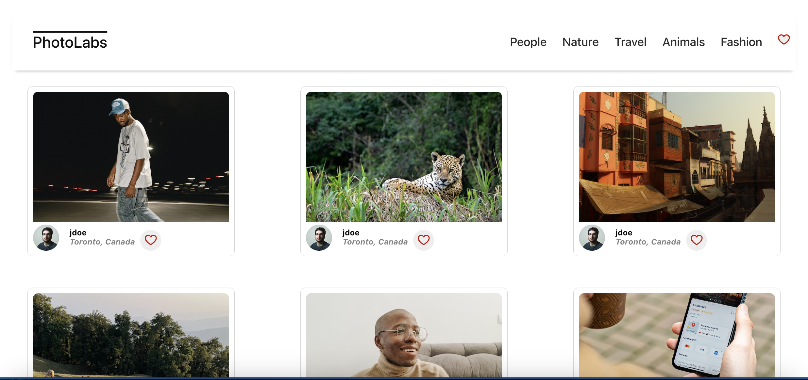
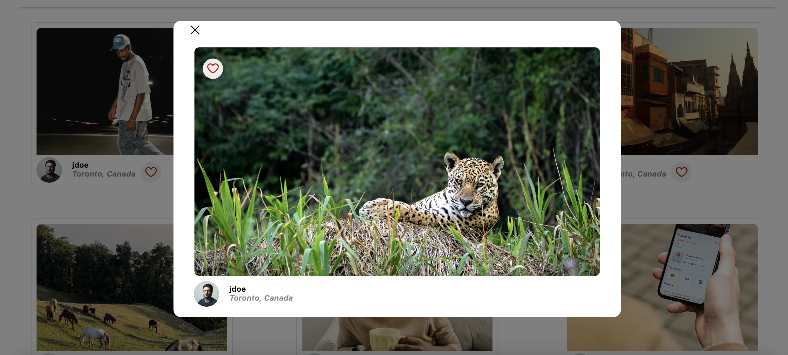
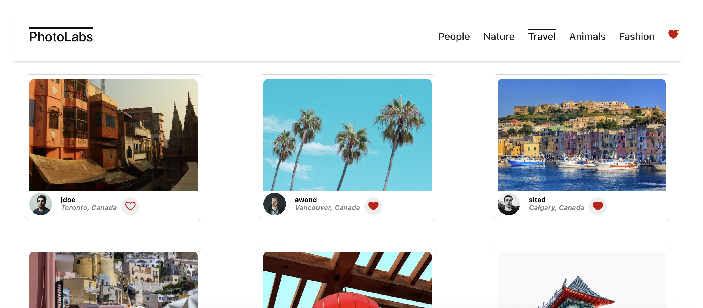

# Photolabs

PhotoLabs is a Single-Page Application developed with React, SASS, Express, and PostgreSQL. Users can like and view larger versions of photos, as well as similar photos to the one they have clicked. Users can also filter photos by category type.

## Getting Started

1. Install dependencies using the `npm install` command in each respective `/frontend` and `/backend` folder.
2. Start the backend server using `npm start` from the /backend folder in your terminal
3. Start the frontend server using `npm start` from the /frontend folder in another terminal tab
  i) React should automatically open the page but if it does not go to <http://localhost:3000/> in your browser.

## Dependencies

### Frontend
- sass
- dart-sass
- react
- react-dom
- react-scripts
- web-vitals

### Backend
- body-parser
- cors
- dotenv
- express
- helmet
- pg
- socket.io
- ws

## Screenshots

> The landing page that shows a complete fetch request for all images

> Modal appears with larger image when user clicks a tile

> Filtered image results when topic is selected, as well as likes behaviour